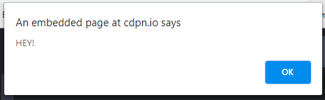

# Intro to Vanilla JavaScript
## Overview

### What You'll Learn
In this section, you'll learn
1. Basic JavaScript
2. Building on pre-existing HTML frameworks and using elements such as buttons to trigger JavaScript code
3. Thing 3

### Prerequisites
Before starting this section, you should have an understanding of
1. How to create a file with an editor of your choice
2. Basic knowledge of HTML and CSS [Section](Link) <!-- nav to html css tut !-->
3.

### Goal
At the end of this section, you should be able to add interactivity to your website via JS!

### The Very Basics of JavaScript: Introduction, Hello World and Variables
For this tutorial we will be using a basic framework of HTML, some CSS and JavaScript to run and test our code. The website [Codepen](https://www.codepen.io/) perfectly fits this description.

Navigate to the website and click the **Start Coding** button. You will be redirected to an interface with HTML, CSS and JavaScript panels, a console, and a segment of the screen that shows the front end result of your code <!-- last part needs to be reworded idk how to describe it !-->. For now we will focus on the console and JS panel.

In the JavaScript panel, type ```console.log("Hello World")```. Make note that JavaScript syntax is similar to Python in that semicolons are optional in most situations. The above statement will run with or without one. If you open the console now, you will see it has printed the string ```"Hello World"```.

Another thing you can do with JavaScript is create browser alerts. Type ```alert("[Your message here]")``` in the JavaScript panel and you will get a popup from the website with the message.

Example:
```
alert("HEY!")
```
Returns
<br />


Lets also discuss comment syntax. Comment syntax in JavaScript is the exact same as in C, Java and other languages. Single line comments are made with ```//Your comment here```, and multi-line comments are made with ```/* Your longer comment here */```.

Finally, lets talk about variable syntax. JavaScript's variable syntax is kind of like a combination of Python and C's- while you don't have to declare a variable's exact type, you still have to use some prerequisite keyword before initializing a variable. That keyword is ```var```. You can create a variable without assigning it to a value with ```var myValue``` (remember, there is no need for a semicolon but you can still use one if you like). The next step is to assign the variable to a ***type***. You do this with ```myValue = [type]```, where type is the value of the variable. It is important to note, however, that you can initialize and assign a variable in one line with ```var myValue = [type]```.

JavaScript has seven different data types you can assign your variables to: ```number```,  ```string```,  ```boolean```,  ```null```,  ```undefined```,  ```symbol``` and  ```object```. All of these can be created by setting your variable name equal to the type you want. For some types, it is as easy as setting your variable equal to the type itself (one example is ```var myValue = null```). For others, however, you will need to follow JavaScript's syntax that allows you to signify that your variable is a specific type. Thankfully, this is relatively simple, and if you have experience with other programming languages, you probably know the deal- a string is created when you use ```" "``` (example ```var myString = "A string"```), and a number is created by using a numerical value (example ```var myNum = 2```).

## The Nitty Gritty: Validating User Input
