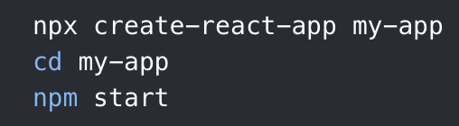
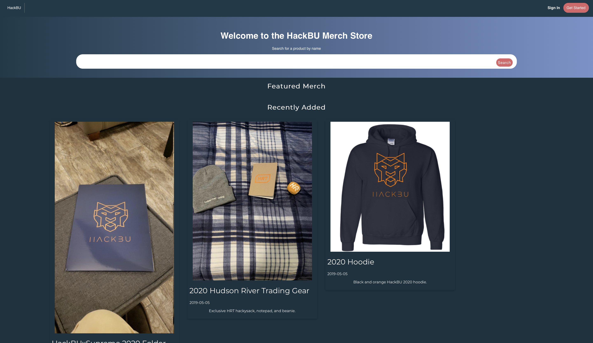
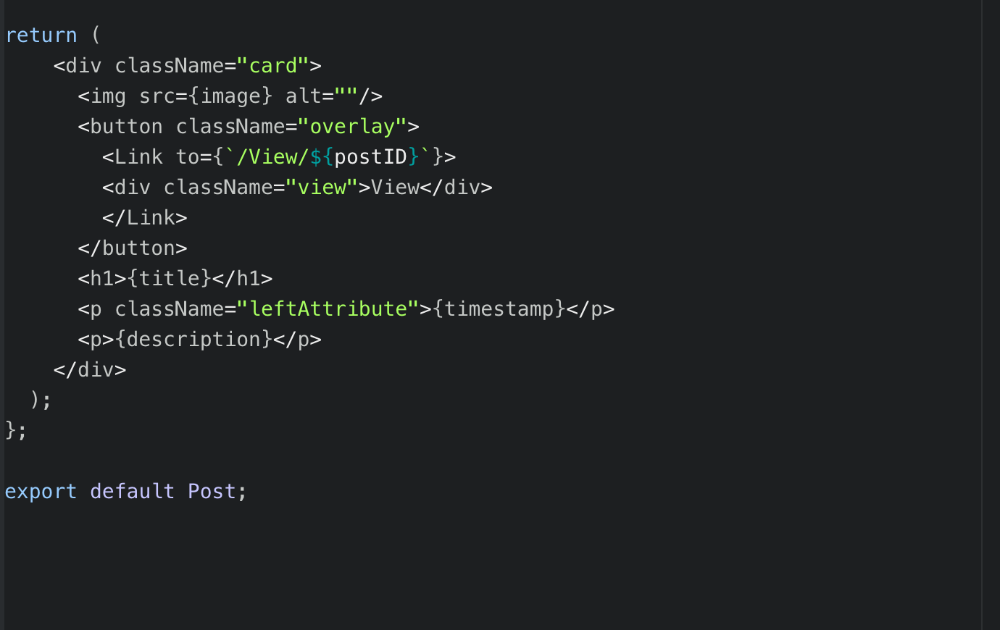
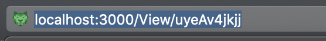
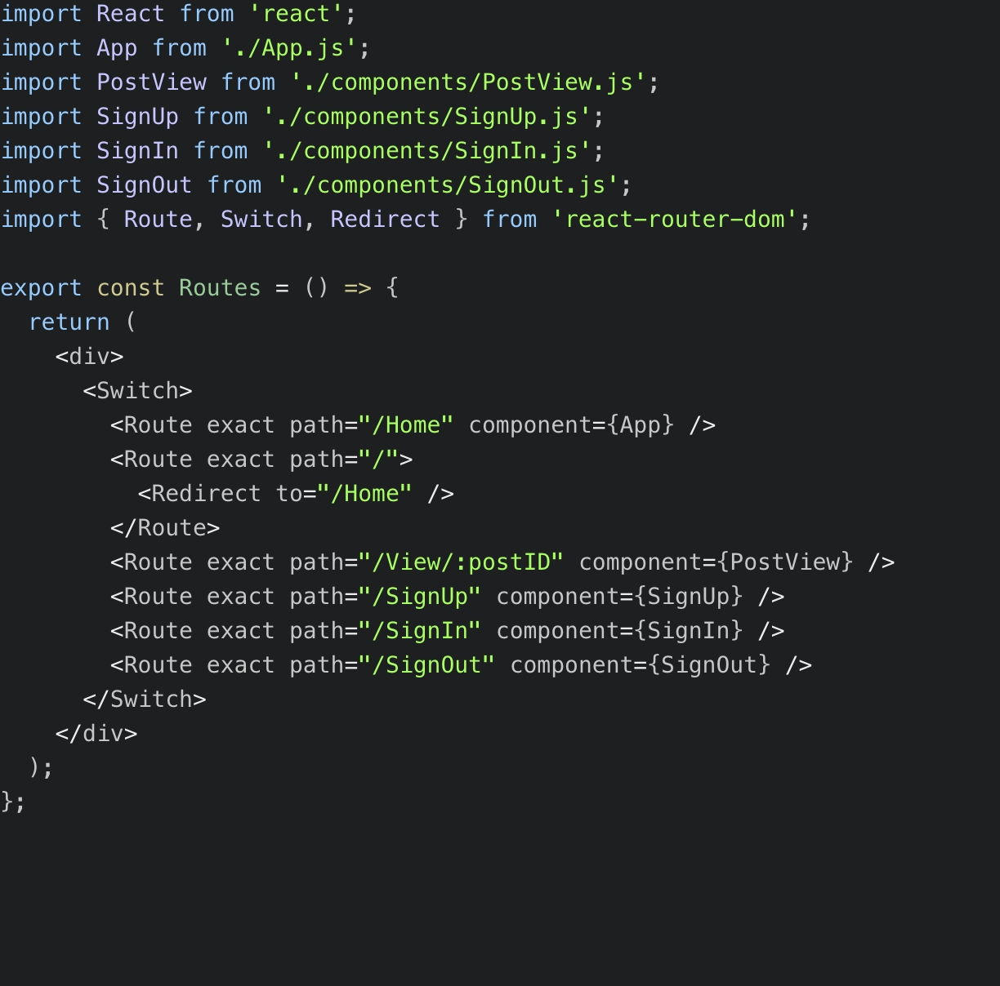
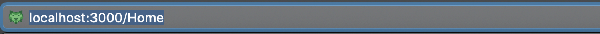
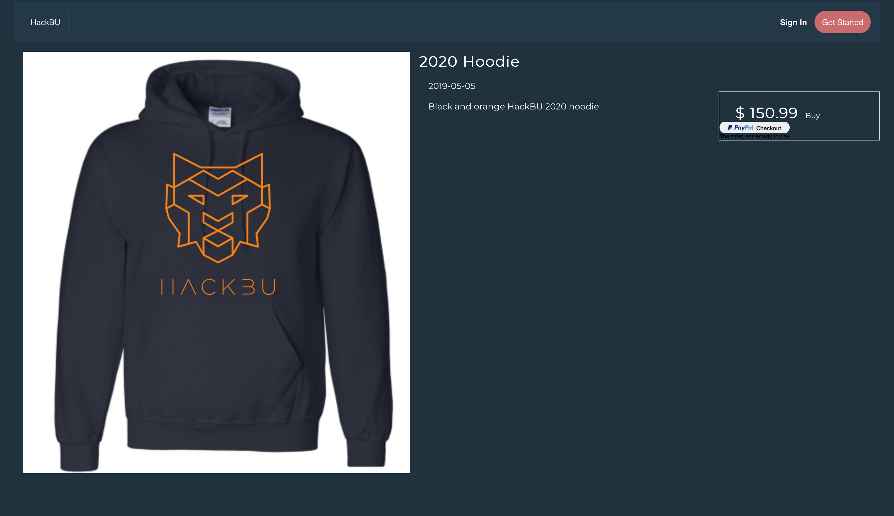

# HackBU - React.js
## Overview
### What you'll learn
1. Installing React, npm, Node.js, and create-react-app
2. How to build React components
3. How to integrate multiple components on a page
4. How to route pages using React-router
5. How to use the previous steps to build a React single-page-application

### Introduction
For today's project we will be creating a React.JS web application that serves as a store for HackBU gear. In this workshop we'll be focusing specifically on using React to create front-end components. In the demo project, I wrote some server-side PHP code to send and receive data like images, names, etc. from an externally hosted database. While we won't focus on the back-end of this web application today, feel free to poke around in the code to see how it works, if interested.

---

## Getting Started

If you're unfamiliar with React.JS, it will be extremely beneficial to first check out [HackBU's React tutorial](https://github.com/HackBinghamtonArchives/reactDemo). It's a comprehensive guide covering everything from installation and configuration, to creating components, state, routing, deploying, hosting data, etc.

One of my favorite features of React is its ability to store and set state using props. While the guide explains this in-depth, unfortunately, today's tutorial will not have time to.

### First Steps

We'll start with installing React if you haven't already. In your terminal, enter the following command:
```
> npm i react
```
If this command fails, you may still need to install npm, a popular package manager for JavaScript; you can install npm and Node.js (server-side JavaScript) at [nodejs.org](https://nodejs.org).

This project leverages a package called `create-react-app`.

If you'd like to try to build this web app from scratch, you'll need to install `create-react-app` as demonstrated below.



As taken from the React site:

> `create-react-app` sets up your development environment so that you can use the latest JavaScript features, provides a nice developer experience, and optimizes your app for production. Create React App doesn’t handle backend logic or databases; it just creates a frontend build pipeline, so you can use it with any backend you want. Under the hood, it uses Babel and webpack, but you don’t need to know anything about them.


Once you've successfully installed React and any related dependencies, cd into the folder hackBU-react. This will contain all of the
source code for our demo project. Running:
```
> npm start
```
from within this directy should take a few moments, and then open this page in your brower.  



### Building React Components

A React component is essentially a function that returns a UI element. For example, the homepage seen below is comprised of a top navigation bar component which has the tag `<NavBar>`, and a `<Post>` component, which displays the items on the site. Upon opening the file 'src/App.js', you'll see that the first few lines are import statements. Line 1 imports React, and 2 functions which deal with setting state. The next 2 lines import the components `<NavBar>` and `<Post>`.


To demonstrate how a component is built we'll look at `src/components/Post.js`. You'll notice that `<Post>` takes in parameters, these parameters are retrieved from a PHP function that outputs it as JSON data. There are a few lines of JavaScript logic, but there are only 15 lines of JSX which render the `<Post>` component. If you've written html before, this probably looks familiar. Lastly, the final line exports the component, which allows us to reuse it in other files. Moving back to our `src/App.js` file, we can see that the file imports `Post`.





### Integrating Multiple Components

In 'App.js', we can see how multiple posts are rendered depending on the data received from the server. It's easy to see how
the logic used to create the 'Post' component can be extended to other files, such as 'NavBar.js' in order to promote code
reuse and readability.


### React-Router

If you look at the URL in your browser when running the site, you may notice that unlike with a site built in HTML, you
won't see a file extension. If you've ever used Flask before, this may look familiar.



This is due to a package called React-Router. If we open our 'src/routes.js' file, we'll see how this is done, as it's actually quite simple.



First, when the user opens the site, we want to display our homepage, which is the component 'App.'
So, we'll add the following lines:
```
> <Route exact path="/Home" component={App} />
  <Route exact path="/">
  <Redirect to="/Home" />
  </Route>
```

You'll notice the lines are encapsulated by a <Switch> tag, which essentially just groups all of the routes together,
and ensure that there exists a top-to-bottom precedence.

The above lines essentially set our index page to the JSX code returned in the 'App.js' file. Routing the user to the
Sign In, Sign Out, and Sign Up pages follows very similar logic. However, for our 'PostView' component, you'll notice
that the exact path is set to "/View/:postID". This allows us to pass a value, postID to the 'PostView,' which is later
used to retrieve information specific to that item. Data passed to/from components in this manner is called "props," short for
properties. This allows us to do things like conditional rendering without accessing localStorage. Unfortunately,
we won't be going into depth about storing/setting state with props in React, but hopefully, this demo project will help give
you an idea of how it works.




### Putting it all together

Hopefully, this tutorial has shown you how to write JSX code to create one or more components, which can be used in conjunction
to create a cohesive web page. This page may contain links to other parts of the web application, which can be accessed using a
library called react-router, which is used to dynamically pass in information to the URL, rather than requiring to manually load in
a resource, e.g. "index.html". Web applications created in this manner are known as single-page-applications, or SPAs, as only one
page is loaded, which drastically improves site performance.
