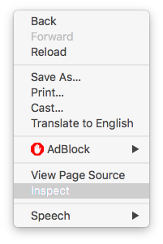
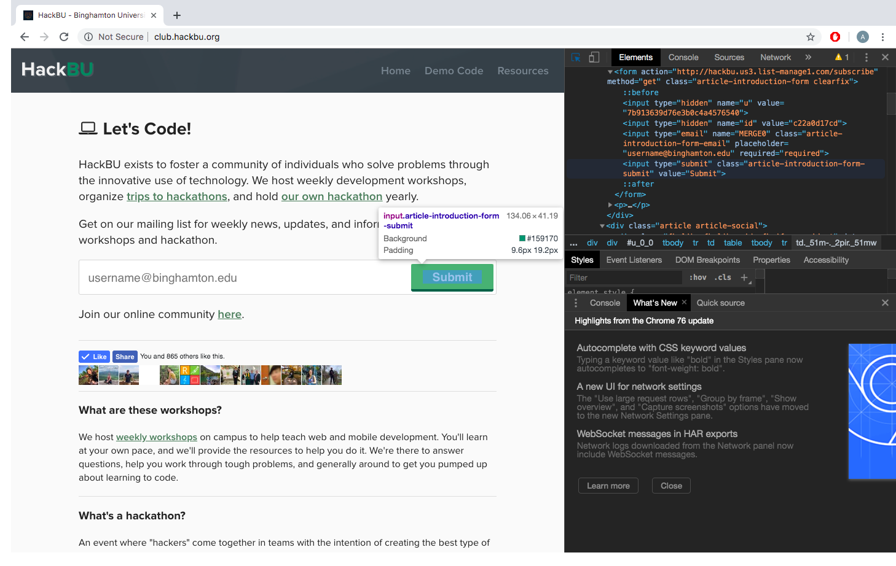

# Web Development: Reverse Engineering

The cool thing about web development is that you can learn by looking at other websites. In this section, we're going to take a look at how you can become a better web developer by developing websites that you can find on the internet. This is also called **reverse engineering** (we'll also use the phrase "reversing a site"), and it's pretty cool.

⚠️*Disclaimer, in this section, we'll learn about using elements from other websites in our own work. This is simply for learning purposes. We at HackBU do not encourage stealing! We are big fans of Open Source, though, so if you are allowed to take resources for your own use then feel free to do so. But Open Source is legal, and we at HackBU would never encourage you to break the law. Happy Coding!*

## This Will Be Short

The purpose of this section (and really every HackBU workshop) is to give you what you need to go out and build something cool. These workshops are designed to give you the knowledge and fundamentals so that you can have the freedom to build whatever you'd like, not just what we tell you. So this section is going to be relatively short. We're going to give you the tools to reverse engineering websites and let you apply that knowledge however you see fit. Of course, we're more than happy to help you in you pursuits! Reverse engineering sites is something that you learn by doing, **so we're going to give you the tools to do it and let you do it**. Let's get started!

## Tools of the Trade

You can reverse a site however you want to. With enough experience you could probably build a duplicate website simply from looking at it (this would require a bunch of time, experience, and probably guessing)!

But what's the point of making it so hard on ourselves when there are resources available to help us?

You guessed it! There is none, unless you want to do it like that, in which case it's totally cool (and impressive, kudos to you)!

But for us mortals, let's look at some really useful tools for reversing a site!

📝*Note: A lot of what you'll see in this section can likely be done in most browsers, but for best results, we recommend Chrome or Firefox*

### Page Source

The *Page Source* is simply the source code for a given website.

 A lot people may not recognize this, a lot of the code that powers websites is available to the users for viewing. The reason for this is that a browser is basically a fancy word processor that doesn't allow edits. By this, we mean that all a browser does is take in some code for a website and present that code to you (the user) in a way that's easy for you to consume. Specifically the web developer will tell the browser how to present their work to you.

If you right click on a blank section of any website, the menu will have an option that says "View Page Source" or something similar as below.

If you choose it, you should find that your browser has opened up a new tab that has code on it. This code will usually be HTML/CSS and maybe a bit of JavaScript. This is the code that powers the *client*, which is a fancy name for the computer that is running the code, i.e. your device. Web development also encompasses writing code for servers, and when code is written for a server, it usually won't be a part of the code you'll find with this feature. But even though you can't see the server code, it's actually a good thing. Making the server readily available to anybody puts companies, data, and people at risk of being used by malicious hackers.

Take a look at the code that comes up, see how well you understand it. When working on your web development skills, you can use source code like that as your inspiration for your code. It can also help you understand how others have done certain things. Say, for example, you want to know how your favorite website displays some data. The page source can be very helpful in learning how to make your own websites better.

### Page Inspector

Viewing the page source is really cool and very exciting, but it can also be a bit scary. If a website has tons of code, you might find yourself looking a huge wall of characters. And worse, sometimes the source code is so jumbled up that it's nearly impossible to understand/read (this can happen when the code is generated by other code).

The *page inspector* helps out with that problem. It presents the source code of the website in chunks so that it's more manageable.

When you right click on blank space in a website, there will also be another choice on the menu that says "Inspect" or "Inspect Element" or something  similar to below.

Upon clicking this option, you should see a pane pop up somewhere on the screen with one or more sections. If you hover over the code, different parts of the actual site should be highlighted.

The page inspector will allow you to focus on certain aspects of the code. This will help you avoid getting distracted by how large the plain source code file is.

You might see that some sections of code look much shorter than they should be. These are *collapsed* blocks of code. There will be a triangular arrow next to those blocks, and you can click the arrow to expand it.

Since the code is already organized, you can use the page inspector to look at specific parts of web pages instead of web pages as a whole. So that means that using this tool, you can learn to implement different parts of different sites. Thus, you can take bits from some places and some pieces from other places to learn how to make your own website as cool as you want it to be! Cool!

You can also use the page inspector to see what your website looks like from a mobile browser by clicking the devices button on the top right (looks like an iphone and an ipad). You can see how the site looks from different mobile device screen sizes.

## Start Small

When you start looking at sites to reverse engineer, start small. You don't want to bite off more than you can chew and overwhelm yourself.

Find a simple site that *only displays information*. You don't want to pick a site that will allow you to input or manipulate data because those will be more complicated. Work your way up to those.

### Website technology identifiers

To see what a website is made of, try running it through [wapplyzer](https://www.wappalyzer.com/). It identifies technologies used on a website.

### Try it yourself

For example, you can use [our website](http://club.hackbu.org/)! It's fairly simple, and it's built to only show information about us.

As you gain more experience and knowledge, you can start moving up to more complicated and larger sites.

## Challenge: Build Your Own Mock Site!

If you're feeling extra saucy, join our #SiteMockHackBU2019! Pick any website you want, and try to re-create it! Remember this is solely for learning purposes, we at HackBU cannot stress enough that we aren't telling you to steal intellectual property (or anything, for that matter 💂🏽‍).

So go get coding! Build your mock site and post some screenshots to [instagram](https://www.instagram.com/hack_bu/)! Be sure to tag us and use the hashtag. Maybe there'll be some cool prize involved. Who knows? 🤷🏿‍
